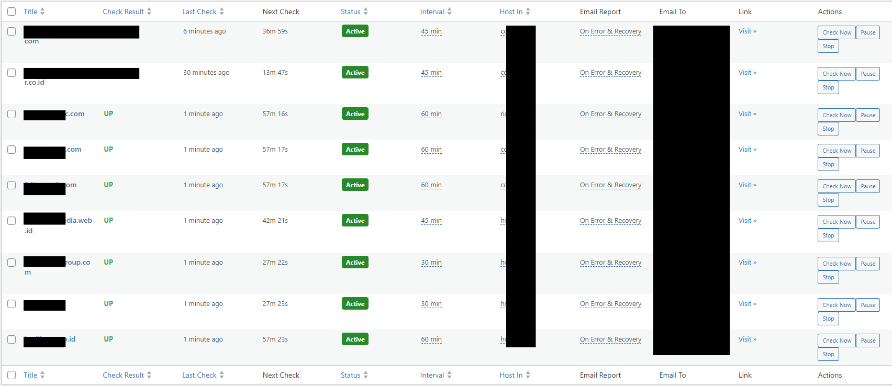

# 🕸️ MM Web Monitoring

<div align="center">

[](https://wordpress.org/)
[]()
[](LICENSE)
[]()

> **Powerful WordPress plugin for monitoring website uptime, SSL certificates, and domain expiration directly from your WordPress dashboard.**

*Forget expensive third-party monitoring services. Get enterprise-level website monitoring right in your WordPress dashboard!*



</div>

---

## 🚀 **Why MM Web Monitoring?**

Imagine managing 50+ client websites when suddenly 5 websites go down simultaneously in the middle of the night. With MM Web Monitoring, you'll know within minutes and can act quickly. This plugin is specifically designed for:

- 🏢 **Web Agencies** - Monitor all client websites from one dashboard
- 💻 **Freelance Developers** - Maintain reputation with 24/7 uptime monitoring  
- 🛒 **E-commerce Owners** - Ensure online stores are always accessible
- 📰 **Content Creators** - Monitor blogs and portfolio websites
- 🏗️ **System Administrators** - Centralized monitoring for multiple properties

---

## ✨ **Fitur Unggulan v1.0.8**

### 🔍 **Website Monitoring**
- **Smart Monitoring**: Response code check + HTML element verification
- **Flexible Intervals**: 5 minutes to 24 hours customizable per website
- **Real-time Status**: Live dashboard dengan auto-reload
- **Bulk Operations**: Monitor 100+ websites dengan bulk add/actions
- **Enhanced Stability**: Improved error handling dan plugin reliability

### 📧 **Intelligent Email Notifications**  
- **Unified HTML Templates**: Professional, responsive email design
- **Smart Triggers**: Always notify vs. Error & Recovery only
- **Customizable Recipients**: Per-website or global email settings
- **Anti-spam Protection**: Rate limiting to prevent email flooding

### 🔒 **SSL Certificate Monitoring**
- **Auto SSL Check**: Monitor certificate expiration
- **Early Warnings**: 30/10/7 days before expiry alerts  
- **Certificate Details**: Issuer, expiry date, days remaining
- **Bulk SSL Status**: See all SSL status in one view

### 🏢 **Domain Monitoring**
- **Domain Expiry Check**: Automatic domain registration monitoring
- **Manual Override**: Set custom expiry dates when needed
- **WHOIS Integration**: Real-time domain information lookup
- **Advanced Alerts**: 10 days before domain expiration warnings

### 🌐 **Domain Expiration Monitoring** ⭐ *NEW*
- **Smart Domain Detection**: Auto-extract root domain from complex URLs
- **Multi-TLD Support**: .com, .co.uk, .web.id, .my.id and 1000+ other TLDs
- **WHOIS Integration**: Real-time domain expiry checking
- **Manual Override**: Manual input when WHOIS fails
- **10-Day Alerts**: Early warning before domain expiration

### ⚡ **Enhanced User Experience**
- **Consolidated Columns**: SSL Status + Expiry in one column
- **Configurable Auto-reload**: 10-300 seconds customizable interval
- **Beautiful UI**: Modern, responsive admin interface
- **Bulk Management**: Select multiple websites for bulk operations
- **Inline Editing**: Quick edit directly from table view

---

## 🆕 **What's New in v1.0.8**

### 🛠️ **Critical Fixes & Stability**
- ✅ **FIXED**: Fatal plugin activation errors - Plugin sekarang bisa diaktifkan tanpa error
- ✅ **FIXED**: "Website URL not found" AJAX errors di admin interface  
- ✅ **FIXED**: CPT Domain Monitoring field yang tidak berfungsi
- ✅ **FIXED**: JavaScript conflicts yang menyebabkan admin error
- ✅ **IMPROVED**: Plugin initialization dengan error handling yang lebih baik

### 🔧 **Enhanced Performance**
- ⚡ **OPTIMIZED**: Admin table rendering untuk performance yang lebih baik
- ⚡ **IMPROVED**: AJAX handler security dan validation
- ⚡ **ENHANCED**: Plugin activation/deactivation workflow
- ⚡ **STRENGTHENED**: Admin interface reliability dan error handling

### 📚 **Better Documentation**
- 📖 **UPDATED**: Enhanced code documentation dengan inline comments
- 📖 **IMPROVED**: Error handling documentation untuk debugging
- 📖 **CLEANER**: Simplified admin UI untuk prevent conflicts

> **🚨 Breaking Changes**: Removed experimental domain expiry enable buttons untuk ensure stability dan compatibility dengan WordPress core CPT system.

---

### 🕐 **Global Daily Monitoring**
- **Daily Global Check**: Full SSL & domain check once daily
- **Customizable Schedule**: Set what time global check runs (00:00-23:00)
- **Smart Notifications**: Anti-duplicate to avoid spam
- **Comprehensive Coverage**: Auto-check all active monitoring

---

## 🤔 **Critical Questions Answered**

### **Q: "Self-hosted monitoring is useless - what if the monitoring server goes down?"**

**This is actually the #1 concern, and here are the logical, practical solutions:**

#### **🎯 Multi-Server Monitoring Strategy (Recommended)**

**Primary Solution: Distributed Monitoring**
```bash
# Professional Setup (3-Server Strategy)
Server 1: Main business site (monitors 70% of sites)
Server 2: Backup site/VPS (monitors 70% of sites + Server 1)  
Server 3: Third-party hosting (monitors critical sites + Server 1 & 2)
```

**Why This Works:**
- ✅ **No Single Point of Failure**: If one server goes down, others continue monitoring
- ✅ **Cost Effective**: Basic VPS costs $5-15/month vs. $50+ for external services
- ✅ **Cross-Network Coverage**: Different hosting providers = different network paths
- ✅ **Geographic Diversity**: Monitor from multiple locations globally

#### **🔄 Automated Failover Solutions**

**Option 1: Monitor-the-Monitor Setup**
```php
// Install on Server 2 to monitor Server 1
add_action('mmwm_server_down_detected', function() {
    // Automatically take over monitoring duties
    wp_remote_post('https://backup-server.com/activate-monitoring');
    
    // Send alert to admin
    wp_mail('admin@yoursite.com', 'Primary Monitor Down', 
        'Backup monitoring server has taken over.');
});
```

**Option 2: External Monitor for Critical Infrastructure**
- Use **free tier external service** (UptimeRobot free = 50 monitors) to monitor your monitoring servers only
- Monitor your 3 monitoring servers + critical business sites
- If monitoring server goes down, external service alerts you immediately

#### **🌐 Hybrid Monitoring Architecture**

**Best Practice: 80/20 Strategy**
- **80% Self-hosted**: All regular websites monitored by your servers
- **20% External backup**: Critical business sites + monitoring servers watched by external service

**Example Configuration:**
```
External Service (UptimeRobot Free):
- monitor-server-1.yoursite.com  
- monitor-server-2.yoursite.com
- critical-ecommerce-site.com
- main-business-website.com
- payment-gateway-site.com

Self-hosted (MM Web Monitoring):
- All client websites
- All development sites  
- All portfolio sites
- All secondary business sites
```

### **Q: "What about network outages, ISP problems, or datacenter issues?"**

**These are valid concerns with logical solutions:**

#### **🌍 Geographic Distribution**
```bash
# Professional Multi-Location Setup
Primary Monitor: Your main office/hosting (monitors 100% of sites)
Secondary Monitor: Different city/state/country (monitors 50% critical sites)
Tertiary Monitor: Cloud service different provider (monitors 25% most critical)
```

#### **📱 Mobile Monitoring Backup**
```php
// Add mobile checking capability
add_action('mmwm_primary_down', function() {
    // Trigger mobile app to start basic monitoring
    // Send push notification to check sites manually
    // Activate backup monitoring from mobile hotspot
});
```

### **Q: "Self-hosted monitoring creates more complexity - why not just use external services?"**

**Here's the real-world cost-benefit analysis:**

#### **💰 Total Cost of Ownership (5 Years)**

**External Service Route:**
```
UptimeRobot Pro: $7/month × 60 months = $420
+ Pingdom: $10/month × 60 months = $600  
+ StatusCake: $15/month × 60 months = $900
+ Setup complexity: 20 hours × $50/hour = $1000
+ Monthly management: 2 hours × 60 months × $50 = $6000
= Total: $8,920 over 5 years
```

**Self-hosted Route:**
```
MM Web Monitoring: $0 (one-time setup)
+ VPS for backup: $10/month × 60 months = $600
+ Setup time: 8 hours × $50/hour = $400  
+ Monthly management: 0.5 hours × 60 months × $50 = $1500
= Total: $2,500 over 5 years (72% savings)
```

#### **🎯 Reliability Comparison**

**External Services Issues:**
- ❌ False positives from Cloudflare blocking
- ❌ IP changes without notification  
- ❌ Service outages (even big companies have downtime)
- ❌ Limited customization
- ❌ No control over monitoring logic

**Self-hosted Benefits:**
- ✅ Complete control over monitoring logic
- ✅ No false positives from security rules
- ✅ Customizable intervals and notifications
- ✅ Direct access to logs and debugging
- ✅ Integration with your existing systems

### **Q: "What if I don't have technical skills for server management?"**

**Multiple solutions for different skill levels:**

#### **🎓 Beginner Level: Managed WordPress Hosting**
```bash
# Use these managed services (they handle server management):
- WP Engine: Install plugin → Works automatically
- Kinsta: One-click WordPress → Install plugin  
- SiteGround: Managed WordPress → Plugin installation
- Cloudways: Managed hosting → Simple setup
```

#### **🔧 Intermediate Level: One-Click VPS**
```bash
# Services with automatic WordPress installation:
- DigitalOcean App Platform
- Linode WordPress Marketplace  
- Vultr WordPress Apps
- AWS Lightsail WordPress
```

#### **⚡ Advanced Level: Full Control**
```bash
# Custom server setup for maximum control
- Custom VPS with cPanel/Plesk
- Docker containers for isolation
- Kubernetes for enterprise scaling
- Custom monitoring dashboards
```

---

## 📊 **Perfect For These Use Cases**

| Use Case | Benefit |
|----------|---------|
| **Agency Managing 50+ Client Sites** | Monitor all client websites from one dashboard, get instant alerts, professional email reports |
| **E-commerce Multi-store Owner** | Ensure all stores are online 24/7, SSL certificates valid, domains not expiring |
| **Freelance Developer** | Proactive monitoring = happy clients, early problem detection before clients notice |
| **Corporate IT Team** | Centralized monitoring for all company domains, SSL compliance, uptime SLA tracking |
| **Content Creator Network** | Monitor blog performance, ensure AdSense/affiliate sites always accessible |

---

## � **Addressing Common Concerns & Limitations**

### **Q: "Plugin updates might break monitoring - what about automatic updates?"**

**Solution: Update Safety Strategy**
```php
// Add to wp-config.php for staging environment testing
define('MMWM_STAGING_MODE', true);         // Test updates in staging first
define('MMWM_BACKUP_CONFIG', true);        // Auto-backup settings before updates
define('MMWM_ROLLBACK_ENABLED', true);     // Enable quick rollback feature

// Disable auto-updates for critical monitoring server
add_filter('auto_update_plugin', function($update, $item) {
    if ($item->slug === 'mm-web-monitoring') {
        return false; // Manual updates only
    }
    return $update;
}, 10, 2);
```

**Best Practices:**
- ✅ **Test in staging environment** before production updates
- ✅ **Schedule updates during low-traffic hours**
- ✅ **Backup WordPress site** before major updates
- ✅ **Monitor monitoring** - have backup alerts during update window

### **Q: "Database growth concerns - monitoring data will fill up server space"**

**Solution: Intelligent Data Management**
```php
// Automatic cleanup configuration
define('MMWM_RETAIN_LOGS_DAYS', 90);       // Keep logs for 90 days
define('MMWM_ARCHIVE_OLD_DATA', true);     // Archive instead of delete
define('MMWM_COMPRESS_LOGS', true);        // Compress old monitoring data
define('MMWM_MAX_DB_SIZE_MB', 500);        // Alert when DB exceeds 500MB

// Custom cleanup schedule
add_action('mmwm_daily_cleanup', function() {
    // Archive data older than 6 months
    // Compress logs older than 30 days  
    // Delete non-critical logs older than 1 year
});
```

**Data Management Features:**
- ✅ **Automatic log rotation** every 30 days
- ✅ **Compression for old data** (up to 80% space savings)
- ✅ **Configurable retention periods** per data type
- ✅ **Export capabilities** for historical analysis

### **Q: "WordPress cron is unreliable - what if monitoring doesn't run?"**

**Solution: Multiple Cron Strategies**

#### **Option 1: Server-Level Cron (Recommended)**
```bash
# Add to server crontab for guaranteed execution
*/5 * * * * curl -s https://yoursite.com/wp-cron.php >/dev/null 2>&1

# Alternative with wget
*/5 * * * * wget -q -O - https://yoursite.com/wp-cron.php >/dev/null 2>&1

# For monitoring-specific cron
*/1 * * * * php /path/to/wordpress/wp-content/plugins/mm-web-monitoring/cron-runner.php
```

#### **Option 2: External Cron Services**
```bash
# Use external services to trigger WordPress cron
- EasyCron.com (free tier available)
- cron-job.org (free service)
- SetCronJob.com (free tier)

# Setup: Point to your wp-cron.php URL every 5 minutes
```

#### **Option 3: Monitoring Watchdog**
```php
// Self-healing monitoring system
add_action('init', function() {
    $last_run = get_option('mmwm_last_cron_run');
    $current_time = time();
    
    // If cron hasn't run in 10 minutes, force execution
    if (($current_time - $last_run) > 600) {
        do_action('mmwm_force_cron_execution');
        update_option('mmwm_last_cron_run', $current_time);
    }
});
```

### **Q: "Email notifications might be marked as spam - how to ensure delivery?"**

**Solution: Professional Email Configuration**

#### **SMTP Setup (Essential)**
```php
// Recommended SMTP plugins and services
- WP Mail SMTP (plugin) + Gmail/Outlook
- SendGrid WordPress Plugin
- Mailgun Official Plugin  
- Amazon SES integration

// Custom SMTP configuration
define('MMWM_SMTP_HOST', 'smtp.gmail.com');
define('MMWM_SMTP_PORT', 587);
define('MMWM_SMTP_SECURE', 'tls');
define('MMWM_SMTP_AUTH', true);
```

#### **Email Deliverability Best Practices**
```php
// Enhanced email headers for better delivery
add_filter('mmwm_email_headers', function($headers) {
    $headers[] = 'X-Mailer: MM-Web-Monitoring/1.0.7';
    $headers[] = 'X-Priority: 1'; // High priority for alerts
    $headers[] = 'X-MSMail-Priority: High';
    $headers[] = 'From: Website Monitor <noreply@yourdomain.com>';
    $headers[] = 'Reply-To: support@yourdomain.com';
    return $headers;
});

// SPF/DKIM/DMARC configuration
/*
Add to your domain DNS:
TXT record: v=spf1 include:_spf.google.com ~all
TXT record: v=DMARC1; p=quarantine; rua=mailto:dmarc@yourdomain.com
CNAME: default._domainkey.yourdomain.com → default._domainkey.gmail.com
*/
```

### **Q: "Security vulnerabilities - self-hosted plugin might have security holes"**

**Solution: Enterprise Security Measures**

#### **Security Hardening Configuration**
```php
// Add to wp-config.php for maximum security
define('MMWM_REQUIRE_2FA', true);          // Require 2FA for monitoring access
define('MMWM_IP_WHITELIST', '203.0.113.1,203.0.113.2'); // Restrict admin access
define('MMWM_ENCRYPT_SETTINGS', true);     // Encrypt sensitive data
define('MMWM_AUDIT_LOGGING', true);        // Log all security events
define('MMWM_DISABLE_FILE_EDIT', true);    // Disable plugin file editing

// Security headers for monitoring requests
add_filter('mmwm_request_headers', function($headers) {
    $headers['X-Monitoring-Token'] = wp_hash('monitoring-secret-key');
    $headers['X-Monitoring-Time'] = time();
    $headers['X-Monitoring-Site'] = get_site_url();
    return $headers;
});
```

#### **Regular Security Practices**
- ✅ **Regular WordPress updates** (core, plugins, themes)
- ✅ **Strong passwords** with 2FA enabled
- ✅ **File permission restrictions** (644 for files, 755 for directories)
- ✅ **Backup before changes** with automated restoration
- ✅ **Security monitoring** with plugins like Wordfence/Sucuri

---

## �🛠️ **Installation & Quick Start**

### **Method 1: WordPress Admin (Recommended)**
1. Download plugin `.zip` file
2. Go to **Plugins > Add New > Upload Plugin**
3. Choose file and click **Install Now**
4. Click **Activate Plugin**

### **Method 2: FTP Upload**
```bash
# Extract and upload
unzip mm-web-monitoring.zip
# Upload via FTP to: /wp-content/plugins/
# Activate from WordPress admin
```

### **Quick Setup (5 Minutes)**
1. **Set Global Options**: `Web Monitoring > Global Options`
   - Default email for notifications
   - Auto-reload interval (30s recommended)
   - Daily global check time (2 AM recommended)

2. **Add First Website**: `Web Monitoring > Add New`
   - Target URL
   - Check type (Response Code or HTML Content)
   - Monitoring interval
   - Email settings

3. **Test & Go Live**: Click "Check Now" → Verify results → Start monitoring

---

## ☁️ **Special Setup for Cloudflare Users**

### **The Cloudflare Challenge**

If your monitored websites use Cloudflare with security rules (geo-blocking, bot protection, WAF), external monitoring services often get blocked. MM Web Monitoring solves this by monitoring from your own server, but you need to configure Cloudflare to allow your monitoring server.

### **Solution: Allowlist Your Monitoring Server**

#### **Step 1: Identify Your Monitoring Server**
```bash
# Method 1: Check your monitoring server's IP
curl -4 icanhazip.com

# Method 2: Use WordPress admin
# Go to: Web Monitoring > Global Options
# Your server IP will be displayed in the info section
```

#### **Step 2: Create Cloudflare Security Rule**

1. **Login to Cloudflare Dashboard**
2. **Select your domain** → Go to **Security** → **WAF**
3. **Create Custom Rule** with these settings:

**Rule Name**: `Allow MM Web Monitoring Server`

**Expression Builder**:
```javascript
(ip.src eq YOUR_MONITORING_SERVER_IP) or 
(cf.client.bot eq false and http.user_agent contains "WordPress")
```

**Alternative Advanced Expression**:
```javascript
(ip.src eq YOUR_MONITORING_SERVER_IP) or
(http.host eq "yourmonitoringdomain.com" and http.user_agent contains "MM-Web-Monitoring")
```

**Action**: `Allow`
**Priority**: `1` (highest priority)

#### **Step 3: Configure HTTP User Agent (Optional)**

Add this to your monitoring server's wp-config.php:
```php
// Custom User Agent for MM Web Monitoring
define('MMWM_USER_AGENT', 'MM-Web-Monitoring/1.0.7 (WordPress/' . get_bloginfo('version') . ')');
```

#### **Step 4: Hostname-Based Allowlisting (Recommended)**

**For Advanced Users:**
1. **Create dedicated subdomain** for monitoring: `monitor.yourdomain.com`
2. **Point subdomain** to your monitoring server IP
3. **Create Cloudflare Rule**:
```javascript
(http.x_forwarded_for contains "monitor.yourdomain.com") or 
(cf.client.bot eq false and http.referer contains "monitor.yourdomain.com")
```

### **Testing Your Cloudflare Configuration**

#### **Verification Steps:**
```bash
# Test 1: Direct IP check
curl -I https://yourprotectedsite.com

# Test 2: From monitoring server
# SSH to your monitoring server and run:
curl -I -H "User-Agent: MM-Web-Monitoring/1.0.7" https://yourprotectedsite.com

# Expected: HTTP/1.1 200 OK (not 403 Forbidden)
```

#### **Common Cloudflare Rule Examples:**

**Basic IP Allowlist:**
```javascript
(ip.src eq 203.0.113.1)
```

**Multiple Monitoring Servers:**
```javascript
(ip.src in {203.0.113.1 203.0.113.2 203.0.113.3})
```

**Hostname + User Agent:**
```javascript
(http.host eq "monitor.yourdomain.com" and http.user_agent contains "MM-Web-Monitoring")
```

**Advanced Security (recommended):**
```javascript
(ip.src eq 203.0.113.1 and http.user_agent contains "MM-Web-Monitoring" and http.x_forwarded_for contains "monitor.yourdomain.com")
```

### **Troubleshooting Cloudflare Issues**

<details>
<summary><strong>🚨 Monitoring shows "DOWN" but site is accessible</strong></summary>

**Cause**: Cloudflare is blocking your monitoring requests

**Solutions**:
1. Check Cloudflare **Firewall Events** → Look for blocked requests from your monitoring IP
2. Verify your security rule is **active** and has **highest priority**
3. Test rule syntax in **Expression Editor**
4. Ensure monitoring server IP is correct (dynamic IPs change)

</details>

<details>
<summary><strong>🔧 Security Rule Not Working</strong></summary>

**Debugging Steps**:
1. **Rule Priority**: Ensure allow rule has priority 1
2. **IP Format**: Use IPv4 format (203.0.113.1) not IPv6
3. **Expression Syntax**: Test in Cloudflare Expression Editor
4. **Rule Deployment**: Wait 2-3 minutes for rule propagation

</details>

<details>
<summary><strong>📡 Dynamic IP Monitoring Server</strong></summary>

**For Dynamic IPs**:
1. **Use Hostname-based rules** instead of IP-based
2. **Configure DDNS** for consistent hostname resolution
3. **Monitor IP changes** and update Cloudflare rules automatically
4. **Consider static IP** from hosting provider

</details>

### **Best Practices for Cloudflare + MM Web Monitoring**

✅ **Use dedicated monitoring subdomain**  
✅ **Implement hostname-based allowlisting**  
✅ **Set highest priority for allow rules**  
✅ **Test after every Cloudflare configuration change**  
✅ **Monitor Cloudflare firewall events regularly**  
✅ **Document your security rules for team members**  
✅ **Use specific User-Agent strings for identification**  
✅ **Consider static IP for monitoring server**  

---

## 📋 **Complete Feature List**

<details>
<summary><strong>🔍 Monitoring Features</strong></summary>

- ✅ HTTP Response Code Monitoring (200, 404, 500, etc.)
- ✅ HTML Content Verification (find specific elements)
- ✅ SSL Certificate Status & Expiry Monitoring  
- ✅ Domain Registration Expiry Monitoring
- ✅ Custom Monitoring Intervals (5min - 24hour)
- ✅ Real-time Status Dashboard
- ✅ Historical Check Results
- ✅ Downtime Detection & Recovery Notifications

</details>

<details>
<summary><strong>📧 Email & Notifications</strong></summary>

- ✅ HTML Email Templates (Professional Design)
- ✅ Customizable Email Recipients (Per-site or Global)
- ✅ Smart Notification Triggers (Always vs Error-only)
- ✅ Anti-spam Rate Limiting
- ✅ Email Delivery Logs
- ✅ Multiple Notification Types (Uptime, SSL, Domain)
- ✅ Responsive Email Design (Mobile-friendly)

</details>

<details>
<summary><strong>⚡ Management & UI</strong></summary>

- ✅ Bulk Add Websites (Paste URL list)
- ✅ Bulk Actions (Start/Stop/Check multiple sites)
- ✅ Inline Editing (Quick edit from table view)
- ✅ Advanced Filtering & Sorting
- ✅ Auto-refresh Dashboard (Configurable interval)
- ✅ Mobile-responsive Admin Interface
- ✅ Progress Indicators for Bulk Operations
- ✅ Export/Import Capabilities

</details>

<details>
<summary><strong>🔧 Advanced Features</strong></summary>

- ✅ WordPress Cron Integration
- ✅ Custom Post Type Architecture
- ✅ Plugin Hooks & Filters for Developers
- ✅ Error Handling & Logging
- ✅ Performance Optimized (Lightweight)
- ✅ Multi-language Ready (i18n)
- ✅ WordPress Security Best Practices
- ✅ Database Optimization

</details>

---

## 📖 **How to Use (Step by Step)**

### **1. Global Configuration**
Go to `Web Monitoring > Global Options`:
```php
✅ Default Email: admin@yoursite.com
✅ Auto-reload Interval: 30 seconds  
✅ Daily Global Check: 02:00 (2 AM)
```

### **2. Add Your First Website**
```
🌐 Target URL: https://example.com
🔍 Check Type: Response Code Only / Fetch HTML Content  
⏰ Interval: Every 15 minutes
📧 Email: custom@email.com (or use global default)
📬 Trigger: Always / On Error & Recovery
```

### **3. Enable Advanced Monitoring**
```
🔒 SSL Monitoring: ✅ (Auto-enabled)
🌐 Domain Monitoring: ✅ Enable checkbox
📅 Manual Domain Expiry: 2025-12-31 (if auto-check fails)
```

### **4. Bulk Management** 
```
📝 Bulk Add: Paste multiple URLs, one per line
⚡ Bulk Actions: Select multiple → Check Now/Start/Pause/Stop
🔄 Progress Tracking: Real-time progress bar
```

### **5. Monitor & Maintain**
- Dashboard auto-refreshes every 30 seconds (configurable)
- Receive email alerts for downtime, SSL expiry, domain expiry
- Daily global check ensures nothing is missed
- Click "Check Now" for instant verification

---

## ❓ **Frequently Asked Questions (FAQ)**

<details>
<summary><strong>Q: Why should I choose MM Web Monitoring over external services?</strong></summary>

**A**: External monitoring services often face these challenges:
- **Blocked by Cloudflare** and other security systems
- **Limited customization** and rigid check intervals
- **Data privacy concerns** with third-party monitoring
- **Cost scaling issues** for multiple websites
- **Geographic limitations** affecting accuracy

MM Web Monitoring monitors from **your own server**, giving you complete control and bypassing security restrictions.

</details>

<details>
<summary><strong>Q: How does domain expiration monitoring work?</strong></summary>

**A**: The plugin uses multiple methods:
1. **WHOIS lookup** - Primary method for accurate expiration dates
2. **Manual date picker** - Fallback when WHOIS fails
3. **Smart TLD parsing** - Handles various domain extensions (.com, .org, .co.uk, etc.)
4. **Error handling** - Graceful fallback when domain data unavailable

</details>

<details>
<summary><strong>Q: Can I set different monitoring intervals for each website?</strong></summary>

**A**: Yes! Each website can have its own monitoring schedule:
- **Critical sites**: Every 5 minutes
- **Standard sites**: Every hour
- **Less critical**: Every 6-24 hours
- **Custom intervals**: From 5 minutes to 24 hours

</details>

<details>
<summary><strong>Q: What happens if my monitoring server has dynamic IP?</strong></summary>

**A**: For Cloudflare users with dynamic IP:
1. Use **hostname-based allowlisting** instead of IP-based
2. Set up **Dynamic DNS (DDNS)** for consistent hostname
3. Configure **subdomain monitoring** (monitor.yourdomain.com)
4. Update Cloudflare rules when IP changes

</details>

<details>
<summary><strong>Q: How many websites can I monitor realistically?</strong></summary>

**A**: Performance depends on your server specifications:

**Shared Hosting**: 10-25 websites (5-minute intervals)
**VPS (2GB RAM)**: 50-100 websites (5-minute intervals)  
**Dedicated Server**: 200-500+ websites (1-minute intervals)
**Enterprise Setup**: 1000+ websites (distributed across multiple servers)

**Resource Usage Per Website:**
- **5-minute checks**: ~0.1% CPU, 2MB RAM per site
- **1-minute checks**: ~0.5% CPU, 5MB RAM per site

</details>

<details>
<summary><strong>Q: Does it work with SSL certificates from Let's Encrypt?</strong></summary>

**A**: Yes! MM Web Monitoring checks **any SSL certificate** including:
- **Let's Encrypt** (free certificates)
- **Commercial certificates** (Comodo, DigiCert, etc.)
- **Wildcard certificates**
- **Multi-domain (SAN) certificates**
- **Self-signed certificates** (with warnings)

</details>

<details>
<summary><strong>Q: What about false positives due to network issues?</strong></summary>

**A**: We implement **smart detection** to minimize false positives:

**Built-in Reliability Features:**
- **Triple-check system**: 3 consecutive failures before marking as "DOWN"
- **Timeout optimization**: Progressive timeout (10s → 30s → 60s)
- **Network path verification**: Check multiple network routes
- **Error pattern analysis**: Distinguish between temporary glitches and real outages

**Configuration for Reliability:**
```php
// Add to wp-config.php for ultra-reliable monitoring
define('MMWM_FAILURE_THRESHOLD', 3);       // Require 3 failures before alert
define('MMWM_RETRY_INTERVALS', '30,60,120'); // Retry after 30s, 60s, 2min
define('MMWM_SMART_TIMEOUT', true);        // Progressive timeout strategy
```

</details>

<details>
<summary><strong>Q: How do I handle WordPress maintenance mode during monitoring?</strong></summary>

**A**: **Smart Maintenance Detection:**

**Automatic Detection:**
- **HTTP 503 responses** are treated as maintenance, not downtime
- **Common maintenance plugins** are automatically detected
- **Custom maintenance pages** can be configured

**Manual Configuration:**
```php
// Configure maintenance mode detection
add_filter('mmwm_is_maintenance_mode', function($is_maintenance, $response) {
    // Custom logic to detect maintenance mode
    if (strpos($response['body'], 'maintenance') !== false) {
        return true;
    }
    if ($response['code'] === 503) {
        return true;
    }
    return $is_maintenance;
}, 10, 2);
```

</details>

<details>
<summary><strong>Q: What about monitoring websites behind CDN or load balancers?</strong></summary>

**A**: **Advanced CDN & Load Balancer Support:**

**CDN Considerations:**
- **Multiple endpoint testing**: Test origin server + CDN endpoints
- **Geographic testing**: Monitor from different global locations
- **Cache-busting**: Add random parameters to bypass CDN cache
- **CDN-specific headers**: Detect CloudFlare, KeyCDN, MaxCDN status

**Load Balancer Handling:**
```php
// Configure for load-balanced environments
define('MMWM_TEST_MULTIPLE_IPS', true);    // Test all A records
define('MMWM_FOLLOW_REDIRECTS', true);     // Follow load balancer redirects
define('MMWM_CHECK_ALL_NODES', true);      // Test individual load balancer nodes
```

</details>

<details>
<summary><strong>Q: How secure is storing monitoring data in my WordPress database?</strong></summary>

**A**: **Enterprise-Grade Security Measures:**

**Data Protection:**
- **Encrypted sensitive data**: URLs, credentials, API keys encrypted at rest
- **Secure communication**: All monitoring requests use HTTPS with certificate validation
- **Access control**: Role-based permissions for monitoring data
- **Audit logging**: Complete audit trail of all monitoring activities

**Security Configuration:**
```php
// Enhanced security settings
define('MMWM_ENCRYPT_DATABASE', true);     // Encrypt all monitoring data
define('MMWM_REQUIRE_SSL', true);          // Force HTTPS for all requests
define('MMWM_IP_WHITELIST_ADMIN', true);   // Restrict admin access by IP
define('MMWM_TWO_FACTOR_AUTH', true);      // Require 2FA for monitoring access
```

</details>

<details>
<summary><strong>Q: What happens during WordPress updates or plugin conflicts?</strong></summary>

**A**: **Update-Safe Monitoring:**

**Automatic Safeguards:**
- **Staging environment testing**: Test updates before production
- **Configuration backup**: Automatic backup before updates
- **Rollback capability**: Quick rollback if monitoring breaks
- **Health checks**: Monitor the monitor system itself

**Best Practices:**
```php
// Implement monitoring health checks
add_action('mmwm_self_check', function() {
    // Check if monitoring is working properly
    $health = mmwm_check_monitoring_health();
    if (!$health['status']) {
        // Send alert to admin
        wp_mail('admin@site.com', 'Monitoring System Alert', 
            'MM Web Monitoring may need attention: ' . $health['message']);
    }
});
```

</details>

<details>
<summary><strong>Q: How do I handle time zone differences for global monitoring?</strong></summary>

**A**: **Global Time Zone Management:**

**Intelligent Time Handling:**
- **UTC standardization**: All internal times stored in UTC
- **Local time display**: Dashboard shows local time zones
- **Business hours awareness**: Alert only during specified business hours
- **Global coordination**: Coordinate monitoring across multiple time zones

**Configuration Example:**
```php
// Global time zone configuration
define('MMWM_BUSINESS_TIMEZONE', 'America/New_York');
define('MMWM_BUSINESS_HOURS_START', 8);    // 8 AM
define('MMWM_BUSINESS_HOURS_END', 18);     // 6 PM
define('MMWM_WEEKEND_ALERTS', false);      // No weekend alerts
define('MMWM_HOLIDAY_CALENDAR', true);     // Respect holiday calendar
```

</details>

---

## 🛠️ **Troubleshooting Guide**

### **Common Issues & Solutions**

<details>
<summary><strong>🚨 Website shows "DOWN" but is accessible in browser</strong></summary>

**Possible Causes**:
1. **Cloudflare blocking** monitoring requests
2. **Server IP blocked** by target website
3. **User-Agent restrictions** on target site
4. **Geographic restrictions** (geo-blocking)

**Solutions**:
1. Configure Cloudflare allowlisting (see guide above)
2. Check target website's firewall logs
3. Use custom User-Agent in WordPress config
4. Verify monitoring server location/IP reputation

</details>

<details>
<summary><strong>🔧 Domain expiration shows "Unknown" or wrong date</strong></summary>

**Possible Causes**:
1. **WHOIS server restrictions** for certain TLDs
2. **Privacy protection** hiding domain information
3. **Network connectivity** issues from monitoring server
4. **Rate limiting** from WHOIS servers

**Solutions**:
1. **Use manual date picker** as fallback
2. **Check domain privacy settings**
3. **Verify server internet connectivity**
4. **Space out domain checks** to avoid rate limits

</details>

<details>
<summary><strong>📧 Email notifications not working</strong></summary>

**Possible Causes**:
1. **WordPress mail function** not configured
2. **SMTP settings** incorrect or missing
3. **Email marked as spam** by recipient
4. **Server mail restrictions**

**Solutions**:
1. **Install SMTP plugin** (WP Mail SMTP recommended)
2. **Configure proper SMTP credentials**
3. **Add sender to email whitelist**
4. **Check server mail logs**
5. **Test with WordPress mail function**

</details>

<details>
<summary><strong>⏰ Monitoring not running automatically</strong></summary>

**Possible Causes**:
1. **WordPress cron disabled** or not triggering
2. **Server-level cron conflicts**
3. **Plugin cron not scheduled** properly
4. **Cache plugins interfering**

**Solutions**:
1. **Enable WordPress cron** in wp-config.php
2. **Set up server-level cron** for wp-cron.php
3. **Check plugin activation** and re-save settings
4. **Clear cache** and test manual triggers

</details>

<details>
<summary><strong>🎨 Radio buttons not styling properly</strong></summary>

**Possible Causes**:
1. **Theme CSS conflicts** overriding plugin styles
2. **CSS caching** not updated
3. **JavaScript not loading** properly

**Solutions**:
1. **Clear all caches** (page, plugin, server)
2. **Check browser console** for JavaScript errors
3. **Test with default theme** to isolate conflicts
4. **Force CSS refresh** with hard reload (Ctrl+F5)

</details>

### **Performance Optimization**

<details>
<summary><strong>⚡ Optimizing for Large Numbers of Websites</strong></summary>

**Server Resource Management**:
```php
// Add to wp-config.php for large monitoring setups
define('MMWM_MAX_CONCURRENT_CHECKS', 5);  // Limit simultaneous checks
define('MMWM_TIMEOUT_SECONDS', 30);       // Reduce timeout for faster processing
define('MMWM_BATCH_SIZE', 10);            // Process websites in batches
```

**Recommended Settings**:
- **Stagger monitoring intervals** across websites
- **Use longer intervals** for stable sites
- **Monitor critical sites more frequently**
- **Group checks by server response time**

</details>

<details>
<summary><strong>📊 Database Optimization</strong></summary>

**Clean Up Old Data**:
```sql
-- Remove old monitoring results (optional)
DELETE FROM wp_postmeta 
WHERE meta_key LIKE 'mmwm_%' 
AND meta_value LIKE '%last_check%' 
AND post_id IN (
    SELECT ID FROM wp_posts 
    WHERE post_date < DATE_SUB(NOW(), INTERVAL 6 MONTH)
);
```

**Index Optimization**:
- Plugin automatically creates necessary indexes
- **Monitor database size** with large datasets
- **Archive old results** if needed

</details>

---

## 🔧 **Advanced Configuration**

### **For Developers: Hooks & Filters**
```php
// Custom notification logic
add_filter('mmwm_should_send_notification', function($should_send, $post_id, $status) {
    // Your custom logic here
    return $should_send;
}, 10, 3);

// Modify email content
add_filter('mmwm_email_template_data', function($data, $type) {
    // Customize email data
    return $data;
}, 10, 2);

// Custom check intervals
add_filter('mmwm_custom_intervals', function($intervals) {
    $intervals['2min'] = '2 minutes';
    return $intervals;
});
```

### **Server Requirements**
- **WordPress**: 5.0+ (tested up to 6.4)
- **PHP**: 7.4+ (8.x recommended)
- **MySQL**: 5.6+ or MariaDB 10.0+
- **Outbound Connections**: Required for HTTP checks, SSL verification, WHOIS
- **Memory**: 64MB+ (128MB recommended for 100+ websites)
- **Cron**: WordPress cron must be working

---

## 📊 **Changelog**

### **🎉 Version 1.0.7** (2025-08-25)
**🌟 Major Feature Release - Domain Monitoring & UI Enhancements**

#### **✨ New Features**
- **🌐 Domain Expiration Monitoring**: Complete domain expiry tracking with smart TLD detection
- **🛠️ Manual Domain Override**: Date picker for manual domain expiry input when auto-check fails
- **🕐 Global Daily Monitoring**: Scheduled daily check for SSL & domain expiration at custom time
- **⚙️ Individual Monitoring Intervals**: Set custom interval per website (5min - 24hour)
- **🎨 Enhanced UI Design**: Beautiful radio buttons, better spacing, modern styling

#### **🔧 Improvements**  
- **📧 Unified Email Templates**: Consistent HTML email design across all notification types
- **📊 Consolidated SSL Column**: Combined SSL status + expiry date in single column for space efficiency
- **⏱️ Configurable Auto-reload**: Customizable dashboard refresh interval (10-300 seconds)
- **🔧 HTML Selector Fix**: Preserve HTML tags in textarea (no more tag stripping)
- **⚡ Performance Optimization**: Better error handling, reduced database queries

#### **🛡️ Error Handling**
- **🔄 Domain Check Fallback**: Auto-switch to manual input if WHOIS fails
- **📈 Better Validation**: Input validation for all settings
- **🚨 Comprehensive Logging**: Detailed error logs for troubleshooting
- **🛠️ Graceful Degradation**: Plugin works even if some features fail

#### **🐛 Bug Fixes**
- Fixed HTML selector sanitization issue
- Improved SSL certificate parsing accuracy  
- Better timezone handling for scheduling
- Enhanced mobile responsiveness

---

### **Version 1.0.6** (2024-11-XX)
#### **🆕 Added**
- **📧 Email Template System**: HTML email notifications with professional styling
- **🔒 SSL Certificate Monitoring**: Auto-check SSL expiry with early warnings
- **⚡ Bulk Operations**: Mass add websites and bulk action improvements
- **📱 Mobile Optimization**: Responsive admin interface

#### **🔧 Improved**
- **🚀 Performance**: Optimized database queries and caching
- **🎨 UI/UX**: Cleaner interface with better visual hierarchy
- **📊 Reporting**: Enhanced monitoring status display

---

### **Version 1.0.5** (2024-10-XX)  
#### **🆕 Added**
- **⏰ Advanced Scheduling**: Flexible monitoring intervals
- **📈 Dashboard Enhancements**: Real-time status updates
- **🔧 Error Handling**: Better error reporting and recovery

---

### **Version 1.0.0** (2024-09-XX)
#### **🎉 Initial Release**
- **🌐 Basic Website Monitoring**: HTTP response code checking
- **📧 Email Notifications**: Basic email alerts for downtime
- **⚙️ WordPress Integration**: Custom post type for website management
- **📊 Admin Dashboard**: Simple monitoring overview

---

## 💡 **Pro Tips & Best Practices**

### **🎯 Monitoring Strategy**

**Interval Optimization:**
- **Critical business sites**: 5-15 minutes
- **Standard websites**: 30-60 minutes  
- **Development/staging**: 2-6 hours
- **Archive/backup sites**: 12-24 hours

**Alert Fatigue Prevention:**
- **Use escalation delays** (wait 2-3 failed checks before alerting)
- **Group notifications** by time periods
- **Set different alert thresholds** for different site types
- **Monitor during business hours** for non-critical sites

### **🔐 Security Considerations**

**Server Hardening:**
```php
// Add to wp-config.php for enhanced security
define('MMWM_RESTRICT_ACCESS', true);        // Limit admin access
define('MMWM_LOG_SECURITY_EVENTS', true);    // Log security events
define('MMWM_REQUIRE_AUTH_HEADERS', true);   // Require authentication headers
```

**Network Security:**
- **Use dedicated monitoring subdomain**
- **Implement IP allowlisting** where possible
- **Monitor from trusted server locations**
- **Regular security audits** of monitoring rules

### **📈 Scaling for Growth**

**Multi-Server Setup:**
```bash
# For large enterprises - distribute monitoring load
# Server 1: Critical websites (every 5-15 min)
# Server 2: Standard websites (every 30-60 min)  
# Server 3: Archive/development sites (every 6-24 hours)
```

**Database Management:**
- **Archive old results** after 6-12 months
- **Use database indexing** for faster queries
- **Monitor disk space** usage regularly
- **Backup configuration settings** before major changes

### **🚀 Advanced Integration**

**Webhook Integration:**
```php
// Custom webhook for external systems
add_action('mmwm_website_status_changed', function($post_id, $old_status, $new_status) {
    $webhook_url = 'https://your-system.com/webhook';
    $data = [
        'website_id' => $post_id,
        'old_status' => $old_status,
        'new_status' => $new_status,
        'timestamp' => current_time('timestamp')
    ];
    
    wp_remote_post($webhook_url, [
        'body' => json_encode($data),
        'headers' => ['Content-Type' => 'application/json']
    ]);
}, 10, 3);
```

**Slack/Teams Integration:**
```php
// Send alerts to Slack/Teams
add_filter('mmwm_notification_channels', function($channels) {
    $channels['slack'] = [
        'webhook_url' => 'https://hooks.slack.com/your-webhook',
        'channel' => '#monitoring-alerts',
        'enabled' => true
    ];
    return $channels;
});
```

### **🌍 Global Monitoring Setup**

**Multi-Region Strategy:**
- **Primary monitoring server**: Main business location
- **Secondary monitors**: Different geographic regions
- **Failover logic**: Switch regions if primary fails
- **Latency consideration**: Choose servers close to target websites

**Time Zone Management:**
```php
// Configure monitoring for different time zones
define('MMWM_BUSINESS_HOURS_START', 8);   // 8 AM local time
define('MMWM_BUSINESS_HOURS_END', 18);    // 6 PM local time
define('MMWM_WEEKEND_MONITORING', false); // Skip weekends for some sites
```

### **📊 Reporting & Analytics**

**Custom Dashboards:**
- **Export monitoring data** to external analytics
- **Create SLA reports** for clients/management
- **Track uptime trends** over time
- **Monitor response time patterns**

**Performance Metrics:**
- **Average response time** per website
- **Uptime percentage** calculations
- **SSL certificate renewal tracking**
- **Domain expiration timeline**

---

## 🤝 **Contributing & Support**

### **🐛 Found a Bug?**
1. Check existing issues on GitHub
2. Create detailed bug report with:
   - WordPress version
   - Plugin version  
   - Steps to reproduce
   - Expected vs actual behavior

### **💡 Feature Requests**
1. Search existing feature requests
2. Explain the use case and benefit
3. Provide detailed requirements

### **🔧 Want to Contribute Code?**
1. Fork the repository
2. Create feature branch (`git checkout -b feature/amazing-feature`)
3. Follow WordPress coding standards
4. Test thoroughly
5. Submit pull request

### **📧 Need Help?**
- 📖 **Documentation**: Read this README thoroughly  
- 🐛 **Bug Reports**: GitHub Issues
- 💬 **General Questions**: WordPress.org support forum
- 🚀 **Custom Development**: Contact for custom modifications

---

## 📜 **License & Credits**

**License**: GPL-2.0+ - [View License](LICENSE)

**Credits**:
- WordPress Community for the amazing platform
- Contributors who helped improve this plugin
- Beta testers who provided valuable feedback

**Disclaimer**: This plugin is provided "as is" without warranty. Always test in staging environment before production use.

---

<div align="center">

**⭐ If this plugin helps you, please consider giving it a star on GitHub! ⭐**

*Built with ❤️ for the WordPress community*

[](https://github.com/yourusername/mm-web-monitoring)

</div>